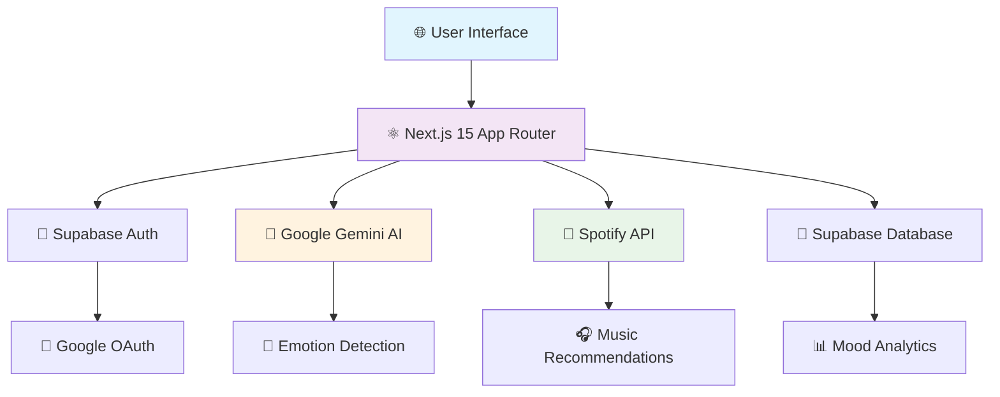
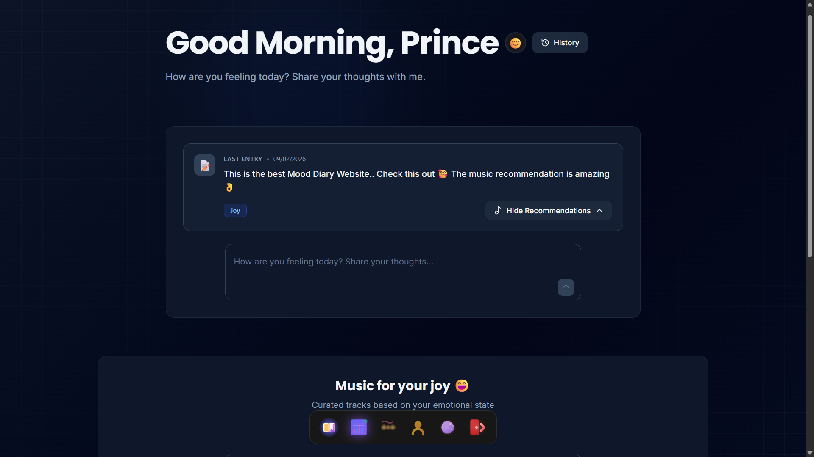
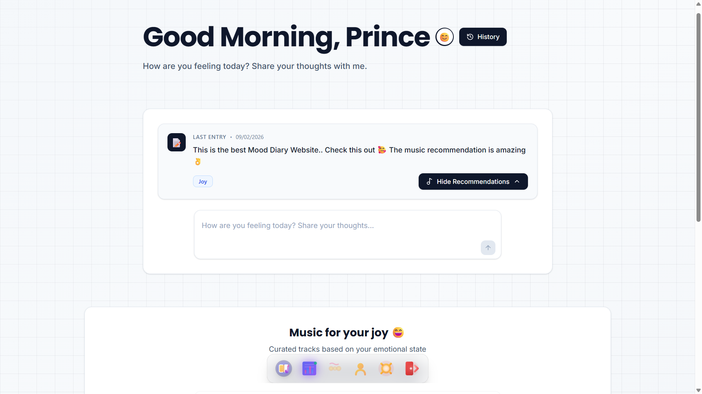

# 🎵 MoodMelody - Your Personal Music Mood Diary

<div align="center">


**Track your emotions, discover music, and relive your journey through an AI-powered mood diary**

[](https://mood-melody-app.vercel.app)
[](https://github.com/HackStyx/MoodMelody)
[](https://nextjs.org/)
[](https://vercel.com)

</div>

---

## ✨ **What Makes MoodMelody Magical?**

<div align="center">


*MoodMelody transforms your daily emotional journey into a beautiful symphony of self-discovery*

</div>

---

## 🚀 **Core Features**

<table>
<tr>
<td width="50%" valign="top">

### 🧠 **AI-Powered Emotion Detection**
> *Accurate emotion analysis with cutting-edge AI*

🎯 **Google Gemini** - Primary emotion detection with fallback keys for reliability  
🌍 **Multi-language support** - Broader emotional understanding  
⚡ **Real-time processing** - Instant mood detection as you type  
🎨 **Confidence scoring** - Know how certain the AI is about your mood  
🔄 **Keyword fallback** - Enhanced local detection when API is unavailable  

</td>
<td width="50%" valign="top">

### 🎵 **Smart Music Curation**
> *Your emotions, your soundtrack*

🎧 **Spotify Integration** - Millions of songs at your fingertips  
🌏 **Localized Recommendations** - Music that speaks your language  
🎭 **Mood-Matched Playlists** - Perfect songs for every feeling  
🎯 **Focused Curation** - Quality over quantity, every time  

</td>
</tr>
<tr>
<td width="50%" valign="top">

### 📊 **Beautiful Analytics Dashboard**
> *See your emotional growth in stunning visuals*

📈 **Interactive Charts** - Watch your mood patterns unfold  
🔥 **Streak Tracking** - Gamify your journaling journey  
🎨 **6-Month Trends** - Long-term emotional insights  
🤖 **AI-Generated Reports** - Deep analysis of your emotional patterns  

</td>
<td width="50%" valign="top">

### ✨ **Magical User Experience**
> *Designed to delight, built to perform*

🎨 **Modern UI** - Dark glass-style modals, clean layouts, no-scroll premium popup  
📱 **PWA Ready** - Install like a native app  
🌙 **Dark/Light Themes** - Adapts to your preference  
⚡ **Lightning Fast** - Optimized for speed and performance  
🏠 **Landing & Pricing** - Get Started flow with Premium “Coming Soon” experience  

</td>
</tr>
</table>

---


### 🎭 **The Emotion Journey 🌟**
```
📝 Write Your Thoughts → 🧠 AI Analyzes Your Mood → 🎵 Get Perfect Music → 📊 Track Your Growth
```

<div align="center">

| Feature | What It Does | Why It's Awesome |
|---------|-------------|------------------|
| 📝 **Smart Journaling** | Write daily entries with automatic emotion detection | *Never wonder about your mood again* |
| 🎵 **Music Discovery** | Get personalized songs based on detected emotions | *Discover your new favorite song every day* |
| 📊 **Growth Analytics** | Visualize emotional patterns over time | *Watch yourself grow and improve* |
| 🔥 **Streak System** | Maintain daily journaling habits | *Turn self-care into a fun game* |
| 🌍 **Global Support** | 7 languages with localized music | *Everyone deserves emotional wellness* |

</div>

---

## 🛠️ **Tech Stack**

<div align="center">


</div>

<table>
<tr>
<td width="33%" valign="top">

### 🎨 **Frontend Excellence**
[](https://nextjs.org/)
[](https://reactjs.org/)
[](https://www.typescriptlang.org/)
[](https://tailwindcss.com/)

</td>
<td width="33%" valign="top">

### 🤖 **AI & Backend Power**
[](https://supabase.com/)
[](https://ai.google.dev/)
[](https://developer.spotify.com/)


</td>
<td width="33%" valign="top">

### ⚡ **Performance & Tools**
[](https://vercel.com/)
[](https://www.framer.com/motion/)
[](https://www.radix-ui.com/)
[](https://web.dev/progressive-web-apps/)


</td>
</tr>
</table>

---

### 🏗️ **Architecture Overview**

<div align="center">


```mermaid
graph TB
    A[🌐 User Interface] --> B[⚛️ Next.js 15 App Router]
    B --> C[🔐 Supabase Auth]
    B --> D[🤖 Google Gemini AI]
    B --> E[🎵 Spotify API]
    B --> F[💾 Supabase Database]
    
    C --> G[👤 Google OAuth]
    D --> H[🧠 Emotion Detection]
    E --> I[🎧 Music Recommendations]
    F --> J[📊 Mood Analytics]
    
    style A fill:#e1f5fe
    style B fill:#f3e5f5
    style D fill:#fff3e0
    style E fill:#e8f5e8
```

</div>


---

## 🚀 Quick Start

### **1. Clone the repository**
```bash
git clone https://github.com/HackStyx/MoodMelody.git
cd MoodMelody
```
*(If the app lives in a subfolder such as `mood-app`, run `cd mood-app` after cloning.)*

### **2. Install Dependencies**
```bash
npm install
```

### **3. Environment Setup**
Create a `.env.local` file in the project root with your API keys:

```env
# Supabase (Auth & Database)
NEXT_PUBLIC_SUPABASE_URL=your_supabase_url
NEXT_PUBLIC_SUPABASE_ANON_KEY=your_supabase_anon_key

# AI Emotion Detection (Google Gemini — primary + optional fallback)
GEMINI_API_KEY=your_gemini_api_key
GEMINI_FALLBACK_API_KEY=your_gemini_fallback_key

# Spotify Music Recommendations
SPOTIFY_CLIENT_ID=your_spotify_client_id
SPOTIFY_CLIENT_SECRET=your_spotify_client_secret
```

### **4. Database Setup**
Set up Supabase and run the schema. See `DATABASE_SETUP.md` for details.

```bash
# Apply schema via Supabase SQL Editor or CLI
# Use the SQL in database/schema.sql
```

### **5. Run Development Server**
```bash
npm run dev
```

Open [http://localhost:3000](http://localhost:3000) to see MoodMelody in action!

## 📱 Screenshots

<div align="center">

### **🏠 Homepage**
| Dark | Light |
|------|--------|
|  |  |

*Landing page with pricing (Basic free, Premium), **Get Started** / **Get Started Now** CTAs, and a premium modal (no-scroll, wide layout) for the Premium experience.*

### **📊 Dashboard**
*Mood tracking, chat-style journal with AI emotion detection, and music recommendations*

### **📈 Mood History**
*Charts, heatmap, and AI-generated insights*

### **👤 Profile**
*Profile and preferences*

</div>

## 🎯 **What Makes MoodMelody Special**

<div align="center">

*Dive deep into the technology and intelligence that powers your emotional journey*

</div>

<table>
<tr>
<td width="50%" valign="top">

### 🧠 **AI Emotion Detection**
> *The brain behind your mood tracking*

<div style="background: linear-gradient(135deg, #667eea 0%, #764ba2 100%); padding: 20px; border-radius: 12px; color: white; margin: 10px 0;">

**🎯 Reliable emotion analysis**
- **🥇 Primary engine**: Google Gemini API (with optional fallback key)
- **🔄 Smart fallback**: Enhanced keyword-based detection when API is unavailable
- **🌍 Broad support**: Multi-language understanding
- **📊 Confidence metrics**: Real-time certainty scoring

</div>

*"From 'feeling overwhelmed' to clear emotional insight in milliseconds"*

</td>
<td width="50%" valign="top">

### 🎵 **Smart Music Curation**
> *Your emotions, transformed into the perfect soundtrack*

<div style="background: linear-gradient(135deg, #f093fb 0%, #f5576c 100%); padding: 20px; border-radius: 12px; color: white; margin: 10px 0;">

**🎧 Millions of Songs at Your Service**
- **🎭 Emotion-First**: Mood-matched musical experiences
- **👤 Personal Touch**: Your taste + AI intelligence
- **🌏 Culturally Aware**: Localized for authentic recommendations
- **⚡ Quality Focus**: Maximum 3 searches for perfect results

</div>

*"Discover your new favorite song every single day"*

</td>
</tr>
<tr>
<td width="50%" valign="top">

### 📊 **Beautiful Analytics**
> *Watch your emotional growth unfold*

<div style="background: linear-gradient(135deg, #a8edea 0%, #fed6e3 100%); padding: 20px; border-radius: 12px; color: #333; margin: 10px 0;">

**📈 Your Journey Visualized**
- **🤖 AI Insights**: GPT-powered mood analysis
- **📅 Trend Tracking**: 6-month emotional patterns
- **🔥 Streak Gamification**: Daily consistency rewards
- **💡 Growth Metrics**: Track your emotional development

</div>

*"See patterns you never knew existed in your emotional world"*

</td>
<td width="50%" valign="top">

### 🔐 **Privacy & Security**
> *Your emotions, safely protected*

<div style="background: linear-gradient(135deg, #ffecd2 0%, #fcb69f 100%); padding: 20px; border-radius: 12px; color: #333; margin: 10px 0;">

**🛡️ Enterprise-Grade Protection**
- **🔐 Google OAuth**: Secure, trusted authentication
- **🔒 Encrypted Storage**: Row-level security policies
- **🔑 API Security**: Environment-protected sensitive data
- **📡 HTTPS Everywhere**: End-to-end encryption

</div>

*"Your most personal thoughts deserve the highest protection"*

</td>
</tr>
</table>

---

### 🌟 **The MoodMelody Difference**

<div align="center">

| What Others Do | What MoodMelody Does | Why It Matters |
|----------------|---------------------|----------------|
| 😐 Basic mood tracking | 🧠 **AI-powered emotion analysis** | *Know exactly how you feel, not just guess* |
| 🎵 Generic playlists | 🎯 **Mood-matched music curation** | *Every song resonates with your current state* |
| 📊 Simple charts | 📈 **AI-generated insights** | *Understand patterns and triggers in your emotions* |
| 🔓 Basic security | 🔐 **Enterprise-grade protection** | *Your personal journey stays completely private* |

</div>

## 🌍 Multi-language Support

| Language | Search Terms | Spotify Market | Status |
|----------|-------------|----------------|---------|
| 🇺🇸 English | Native | US | ✅ Active |
| 🇪🇸 Spanish | Localized | ES | ✅ Active |
| 🇫🇷 French | Localized | FR | ✅ Active |
| 🇩🇪 German | Localized | DE | ✅ Active |
| 🇮🇳 Hindi | Localized | IN | ✅ Active |
| 🇨🇳 Chinese | Localized | TW | ✅ Active |
| 🇯🇵 Japanese | Localized | JP | ✅ Active |

## 🤝 Contributing

We welcome contributions! Here's how you can help:

1. **🍴 Fork the repository**
2. **🌿 Create a feature branch** (`git checkout -b feature/amazing-feature`)
3. **💾 Commit your changes** (`git commit -m 'Add amazing feature'`)
4. **🚀 Push to the branch** (`git push origin feature/amazing-feature`)
5. **🔄 Open a Pull Request**


## 📄 API Documentation

### **Emotion Detection API**
```typescript
POST /api/emotion
Content-Type: application/json

{
  "text": "I'm feeling really happy today!"
}

Response:
{
  "emotion": "joy",
  "confidence": 0.95,
  "method": "gemini"
}
```

### **Music Recommendations API**
```typescript
POST /api/spotify/recommendations
Content-Type: application/json

{
  "emotion": "joy",
  "preferences": ["pop", "happy"],
  "language": "en"
}

Response:
{
  "tracks": [...],
  "searches_performed": 2
}
```

## 🔧 Configuration

### **Supabase Setup**
1. Create a new Supabase project
2. Run the provided schema (`database/schema.sql`)
3. Configure authentication providers (Google OAuth)
4. Set up Row Level Security policies

### **API Keys Setup**
- **Gemini**: Enable Generative Language API and create API keys at [Google AI Studio](https://aistudio.google.com/apikey) (use one or two keys for primary/fallback)
- **Spotify**: Create an app at [Spotify Developer Dashboard](https://developer.spotify.com/dashboard)
- **Supabase**: Create a project and use the project URL and anon key from [Supabase](https://supabase.com/dashboard)

## 📊 Analytics & Monitoring

- **📈 Vercel Analytics**: User engagement and behavior tracking
- **⚡ Speed Insights**: Performance monitoring and Core Web Vitals
- **🔍 Error Tracking**: Comprehensive error handling and logging
- **📱 PWA Metrics**: Installation and usage statistics


## 📞 Support

- **🌐 Live Demo**: [mood-melody-app.vercel.app](https://mood-melody-app.vercel.app)
- **📧 Email**: [Contact HackStyx](mailto:princegupta8497@gmail.com)
- **🐙 GitHub**: [Open an Issue](https://github.com/HackStyx/MoodMelody/issues)
- **🐦 Twitter**: [@hackstyx](https://x.com/hackstyx)

## 📜 License

This project is licensed under the MIT License - see the [LICENSE](LICENSE) file for details.

---

<div align="center">

**Made with ❤️ by [HackStyx](https://github.com/HackStyx)**

*MoodMelody - Where emotions meet music* 🎵

</div>
